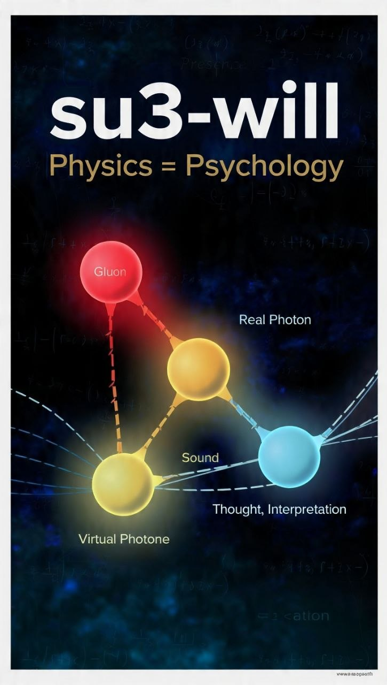

  
   
  <i>Калибровочно-ковариантные нейронные сети SU(3) с математической моделью воли</i>

# su3-will

**SU(3) Gauge-Covariant Neural Networks with a Mathematical Model of Will**

The first GNN architecture with *provable* SU(3) gauge covariance that models human communication as fundamental forces.

## Physics = Psychology
### About
This project introduces the first neural network architecture with mathematically provable SU(3) gauge covariance. 
We model human will and communication using the same mathematical framework as quantum chromodynamics.

**Core Idea**: If physics is described by gauge symmetries, maybe psychology is too.

We decompose communication into 3 forces:

| Force | Physics | Human | Code |
| --- | --- | --- | --- |
| **Gluon** | Strong Force | Touch, Presence | `U @ Z_gluon` |
| **Real Photon** | EM Radiation | Words, Sound | `U @ Z_real * sigmoid(edge_attr)` |
| **Virtual Photon** | Thought | Interpretation | `U @ Z_photon * exp(i*phase(dst))` |

**Will** = `softplus(mass * anticipation + will_power - threshold)`  
Accumulated overcoming. The network learns when to choose truth over thought.

**Gravity** = `mass_dst / (mass_src + mass_dst)`  
Hierarchy emerges from physics, not heuristics.

## Results v3.4

Strict gauge covariance achieved:
